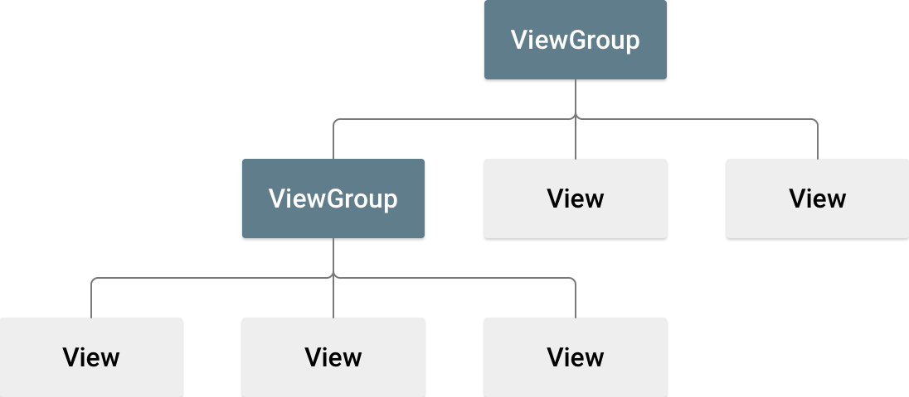
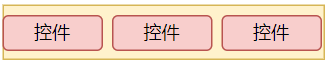

- [布局](#布局)
  - [视图中的布局](#视图中的布局)
  - [编写 XML](#编写-xml)
  - [加载 XML 资源](#加载-xml-资源)
  - [属性](#属性)
  - [布局位置](#布局位置)
  - [常见布局](#常见布局)
- [控件](#控件)
  - [`TextView`（标签）](#textview标签)
  - [`EditText`（文本输入框）](#edittext文本输入框)
  - [`Button`（按钮）](#button按钮)
  - [`ImageView`（图片）](#imageview图片)
  - [`ImageButton`（图片按钮）](#imagebutton图片按钮)
- [其他](#其他)
  - [`Toast`（提示）](#toast提示)

# 布局
## 视图中的布局
* https://developer.android.com/develop/ui/views/layout/declaring-layout?hl=zh-cn
* 布局定义了应用中的界面结构。

`View` 对象通常是控件，如 `TextView`、`Button` 或 `ImageView`。 `ViewGroup` 通常是布局的容器，如 `LinearLayout`、`RelativeLayout` 或 `FrameLayout`。

## 编写 XML
* Android在XML中设计界面布局。使用Android项目的 `res/layout/` 中的 `.xml` 文件进行编译。
* 每个XML文件都必须包含一个根元素，该元素必须是`ViewGroup`或`View`对象。将其他布局或者控件作为子元素添加到根元素中。例如，使用垂直`LinearLayout`来同时显示`TextView`和`Button`。
``` XML
<?xml version="1.0" encoding="utf-8"?>
<LinearLayout xmlns:android="http://schemas.android.com/apk/res/android"
              android:layout_width="match_parent"
              android:layout_height="match_parent"
              android:orientation="vertical" >
    <TextView android:id="@+id/text"
              android:layout_width="wrap_content"
              android:layout_height="wrap_content"
              android:text="Hello, I am a TextView" />
    <Button android:id="@+id/button"
            android:layout_width="wrap_content"
            android:layout_height="wrap_content"
            android:text="Hello, I am a Button" />
</LinearLayout>
```

## 加载 XML 资源
* 编译应用时，系统会将XML布局文件编译成`View`资源。在应用的`Activity.onCreate()`回调方法中，使用`setContentView()`方法将`View`资源加载到`Activity`中。例如，使用`setContentView()`方法加载`activity_main.xml`文件：
``` XML
public class MainActivity extends Activity {
    @Override
    public void onCreate(Bundle savedInstanceState) {
        super.onCreate(savedInstanceState);
        setContentView(R.layout.activity_main);
    }
}
```

## 属性
* 每个`View`和`ViewGroup`对象都有各自的属性，例如：`ID`，这是所有`View`对象的必需属性。
### ID
* 任何`View`对象都必须具有唯一的ID。当应用编译后，系统会将ID映射到`View`对象。语法为：
``` XML
android:id="@+id/[id_name]"
```
* 创建视图并从应用引用它们，如下所示：
1. 定义一个视图，并为其分配唯一ID，示例：
``` XML
<Button android:id="@+id/button"
        android:layout_width="wrap_content"
        android:layout_height="wrap_content"
        android:text="Hello, I am a Button" />
```
2. 从布局中引用该视图，通常使用`onCreate()`方法，示例：
``` XML
public class MainActivity extends Activity {
    @Override
    public void onCreate(Bundle savedInstanceState) {
        super.onCreate(savedInstanceState);
        setContentView(R.layout.activity_main);
        Button button = (Button) findViewById(R.id.button);
    }
}
```
### 布局参数
* `View`对象的布局参数定义了`View`对象在`ViewGroup`中的位置和大小。

* 每个`LayoutParams`子类都有自己的属性。每个视图都使用`layout_width`和`layout_height`属性来定义它们的宽和高，可以使用`match_parent`、`wrap_content`或`固定值`。
  * `match_parent`： 匹配父视图的大小。
  * `wrap_content`： 根据视图内容自适应大小。

## 布局位置
* 每个视图都是矩形几何图形，视图的位置由`x`和`y`坐标定义，以及两个维度，即`width`和`height`，位置和尺寸的单位是像素。

## 常见布局
* 视图或控件都可以嵌套在一个布局中，以形成层次结构。
* `LinearLayout`： 线性布局，用于在垂直或水平方向上排列子视图。
* `RelativeLayout`： 相对布局，用于在相对位置上排列子视图。
* `FrameLayout`： 帧布局，用于在帧内排列子视图。
* `GridLayout`： 网格布局，用于在网格中排列子视图。
* `ConstraintLayout`： 约束布局，用于在约束条件下排列子视图。
### 线性布局
* https://developer.android.google.cn/reference/kotlin/android/widget/LinearLayout
* 线性布局默认在垂直方向上排列子视图。可以使用`android:orientation`属性来更改方向。
  * `android:orientation="horizontal"`： 水平方向

  * `android:orientation="vertical"`： 垂直方向

#### 比例（权重）
* `android:layout_weight`属性用于设置子视图的权重。例如三个按钮的权重分别为1、2、3，那么它们的宽度分别为1/6、2/6、3/6。
``` XML
<LinearLayout
    android:layout_width="match_parent"
    android:layout_height="wrap_content"
    android:orientation="horizontal">
    <Button
        android:layout_width="0dp"
        android:layout_height="wrap_content"
        android:layout_weight="1"
        android:text="Button 1" />
    <Button
        android:layout_width="0dp"
        android:layout_height="wrap_content"
        android:layout_weight="2"
        android:text="Button 2" />
    <Button
        android:layout_width="0dp"
        android:layout_height="wrap_content"
        android:layout_weight="3"
        android:text="Button 3" />
</LinearLayout>
```
#### 对齐
* https://developer.android.google.cn/reference/android/widget/LinearLayout#attr_android:gravity
* 在布局中`android:gravity`属性用于设置子视图的对齐方式。
  * `android:gravity="center"`： 居中对齐
  * `android:gravity="left"`： 左对齐
  * `android:gravity="right"`： 右对齐
  * `android:gravity="top"`： 上对齐
  * `android:gravity="bottom"`： 下对齐
* 使用`android:layout_gravity`属性可以设置子视图在父视图中的对齐方式，值与`android:gravity`相同。

### 约束布局
* https://developer.android.google.cn/reference/androidx/constraintlayout/widget/ConstraintLayout
* 位于`androidx.constraintlayout.widget`包中。
#### 相对定位
* 相对定位是指将视图相对于其他视图进行定位。可以在水平和垂直方向上进行相对定位。例如，按钮B定位到按钮A的右侧：
``` XML
<Button android:id="@+id/buttonA" ... />
<Button android:id="@+id/buttonB" ...
        app:layout_constraintLeft_toRightOf="@+id/buttonA" />
```
* 可以使用下面的约束属性来设置相对定位：
  * `app:layout_constraintLeft_toRightOf`： 左对齐于右侧视图的左侧。
  * `app:layout_constraintRight_toLeftOf`： 右对齐于左侧视图的右侧。
  * `app:layout_constraintTop_toBottomOf`： 上对齐于下侧视图的顶部。
  * `app:layout_constraintBottom_toTopOf`： 下对齐于上侧视图的底部。
  * `app:layout_constraintLeft_toLeftOf`： 左对齐于左侧视图的左侧。
  * `app:layout_constraintRight_toRightOf`： 右对齐于右侧视图的右侧。
  * `app:layout_constraintTop_toTopOf`： 上对齐于上侧视图的顶部。
  * `app:layout_constraintBottom_toBottomOf`： 下对齐于下侧视图的底部。
* 它们都引用了另一个视图的ID或者`parent`（父容器，即ConstraintLayout）：
``` XML
    <Button android:id="@+id/buttonB" ...
            app:layout_constraintLeft_toLeftOf="parent" />
```

#### 边距
* 边距是指试图与视图的边界之间的距离。可以使用下面的约束属性来设置边距：
  * `android:layout_marginLeft`： 左边界的边距。
  * `android:layout_marginRight`： 右边界的边距。
  * `android:layout_marginTop`： 上边界的边距。
  * `android:layout_marginBottom`： 下边界的边距。
  * `android:layout_marginStart`： 开始边界的边距。
  * `android:layout_marginEnd`： 结束边界的边距。
  * `android:layout_margin`： 四个边界的边距。

#### 定心定位（Centering positioning）
* `ConstraintLayout`可以处理“不可能”的约束。例如：
``` XML
<androidx.constraintlayout.widget.ConstraintLayout ...>
    <Button android:id="@+id/button" ...
        app:layout_constraintLeft_toLeftOf="parent"
        app:layout_constraintRight_toRightOf="parent"/>
</>
```
* 除非`ConstraintLayout`与`Button`大小相同，否则约束条件不能同时满足。这种情况下，约束会将`Button`居中。这同样适用于垂直约束。

##### 偏置（Bias）
* 遇到“不可能”的约束时，默认设置是将视图居中。可以使用偏差属性来调整视图的位置，使之偏向一侧而不是另一侧：
  * `app:layout_constraintHorizontal_bias`： 水平偏置。
  * `app:layout_constraintVertical_bias`： 垂直偏置。
* 例如，下面将使左侧的偏差为30%，而不是默认的50%，这样左侧会更短，视图会偏向左侧：
``` XML
<androidx.constraintlayout.widget.ConstraintLayout ...>
    <Button android:id="@+id/button" ...
        app:layout_constraintHorizontal_bias="0.3"
        app:layout_constraintLeft_toLeftOf="parent"
        app:layout_constraintRight_toRightOf="parent"/>
</>
```

#### 圆形定位
* 可以以一定角度和距离约束视图中心相对于另一个视图中心的位置。可以使用以下属性：
  * `app:layout_constraintCircle`： 圆形约束，引用另一个视图ID。
  * `app:layout_constraintCircleAngle`： 圆形约束的角度（以度为单位，从0到360）。
  * `app:layout_constraintCircleRadius`： 圆形约束的半径。
``` XML
 <Button android:id="@+id/buttonA" ... />
 <Button android:id="@+id/buttonB" ...
     app:layout_constraintCircle="@+id/buttonA"
     app:layout_constraintCircleRadius="100dp"
     app:layout_constraintCircleAngle="45" />
```

#### 尺寸约束
* 可以为`ConstraintLayout`本身定义最小和最大尺寸：
  * `android:minWidth`： 最小宽度。
  * `android:maxWidth`： 最大宽度。
  * `android:minHeight`： 最小高度。
  * `android:maxHeight`： 最大高度。
* 当`ConstraintLayout`设置尺寸约束时，`wrap_content`将使用这些约束。
* 视图的尺寸可以使用`android:layout_width`和`android:layout_height`属性设置，值为`match_parent`、`wrap_content`或固定值。
* 百分比尺寸
  * 尺寸应设置为`match_constraint`。
  * 默认值应设置为`app:layout_constraintWidth_default="percent"`和`app:layout_constraintHeight_default="percent"`。
  * 然后将`app:layout_constraintWidth_percent`和`app:layout_constraintHeight_percent`设置为0至1之间的值。
* 比率，可以将视图的一个尺寸定义为另一个尺寸的比例。需要将其中一个约束尺寸设置为`0dp`（即`match_constraint`），并将属性`app:layout_constraintDimensionRatio`设置为给定的比例。例如：
``` XML
// 将按钮的高和宽设置相同
<Button android:layout_width="wrap_content"
        android:layout_height="0dp"
        app:layout_constraintDimensionRatio="1:1" />
```
* 如果两个尺寸都设置为`match_constraint`(0dp)，则可以使用`app:layout_constraintDimensionRatio`属性来设置比例。例如：
``` XML
// 将按照 16:9 的比例设置按钮的高度，而按钮的宽度将与其父级的约束相匹配。
<Button android:layout_width="0dp"
        android:layout_height="0dp"
        app:layout_constraintDimensionRatio="H,16:9"
        app:layout_constraintBottom_toBottomOf="parent"
        app:layout_constraintTop_toTopOf="parent"/>
```

#### 链
* 链将多个视图通过双向连接链接在一起（水平或垂直）。使用`app:layout_constraintStart_toStartOf`、`app:layout_constraintStart_toEndOf`、`app:layout_constraintEnd_toStartOf`和`app:layout_constraintEnd_toEndOf`属性来定义链。例如：
``` XML
<Button
    android:id="@+id/buttonA"
    android:layout_width="wrap_content"
    android:layout_height="wrap_content"
    android:text="buttonA"
    app:layout_constraintTop_toTopOf="parent"
    app:layout_constraintStart_toStartOf="parent"
    app:layout_constraintEnd_toStartOf="@+id/buttonB"
    />

<Button
    android:id="@+id/buttonB"
    android:layout_width="wrap_content"
    android:layout_height="wrap_content"
    android:text="buttonB"
    app:layout_constraintTop_toTopOf="parent"
    app:layout_constraintStart_toEndOf="@+id/buttonA"
    app:layout_constraintEnd_toStartOf="@+id/buttonC"
    />


<Button
    android:id="@+id/buttonC"
    android:layout_width="wrap_content"
    android:layout_height="wrap_content"
    android:text="buttonC"
    app:layout_constraintTop_toTopOf="parent"
    app:layout_constraintStart_toEndOf="@+id/buttonB"
    app:layout_constraintEnd_toEndOf="parent"
    />
```

##### 链头
* 链由第一个元素（链的“头”）上设置的属性控制
* 对于水平链来说，最左边的元素是链头。对于垂直链来说，最上面的元素是链头。
##### 链条样式
* 链头设置属性`app:layout_constraintHorizontal_chainStyle`或`app:layout_constraintVertical_chainStyle`来定义链的样式（默认为`chain_spread`）。
  * `chain_spread`： 元素将会展开
  * `chain_spread_inside`： 元素将会展开，但是第一个元素和最后一个元素将会被固定在链的两端。
  * `chain_pack`： 元素将会被压缩。
  * `chain_pack_inside`： 元素将会被压缩，但是第一个元素和最后一个元素将会被固定在链的两端。
  * `chain_center`： 元素将会被压缩，并且链将会被居中。
  * `chain_center_inside`： 元素将会被压缩，并且链将会被居中，但是第一个元素和最后一个元素将会被固定在链的两端。

#### 虚拟助手
* `Guideline`对象可以在`ConstraintLayout`容器中创建一个垂直或水平的辅助线。然后可以将其他视图与辅助线对齐。
* `Guideline`通过`orientation`属性来定义方向（`vertical`或`horizontal`）。
* `Guideline`有两种放置方式：
  * `app:layout_constraintGuide_percent`： 相对于父容器的百分比。
  * `app:layout_constraintGuide_begin`： 相对于父容器的开始位置。
  * `app:layout_constraintGuide_end`： 相对于父容器的结束位置。
* 例如：
``` XML
// 在父容器中创建一个水平的辅助线，位于父容器的50%位置。
<androidx.constraintlayout.widget.Guideline
    android:id="@+id/guideline"
    android:layout_width="wrap_content"
    android:layout_height="wrap_content"
    app:layout_constraintGuide_percent="0.5"
    android:orientation="horizontal" />
// 将按钮A与辅助线对齐。
<Button
    android:id="@+id/buttonA"
    android:layout_width="wrap_content"
    android:layout_height="wrap_content"
    android:text="buttonA"
    app:layout_constraintStart_toStartOf="parent"
    app:layout_constraintEnd_toStartOf="@+id/guideline"
    app:layout_constraintTop_toTopOf="parent" />
```

# 控件
## `TextView`（标签）
* https://developer.android.google.cn/reference/android/widget/TextView
* 显示文本。示例：
``` XML
// 显示文本 "Hello World!"
<TextView
    android:layout_width="wrap_content"
    android:layout_height="wrap_content"
    android:text="Hello World!" />
```
* `android:text`： 文本内容。
* `android:textSize`： 文本大小。
* `android:textColor`： 文本颜色。
* `android:textStyle`： 文本样式。

## `EditText`（文本输入框）
* https://developer.android.google.cn/reference/android/widget/EditText
* 用于输入和修改文本的用户界面元素。定义编辑文本小部件时，必须指定 R.styleable.TextView_inputType 属性。例如，对于纯文本输入，将 inputType 设置为“text”：
``` XML
 <EditText
     android:id="@+id/plain_text_input"
     android:layout_height="wrap_content"
     android:layout_width="match_parent"
     android:inputType="text"/>
```
* 如果要输入秘密数字，将 inputType 设置为“numberPassword”：
``` XML
 <EditText
     android:id="@+id/password_input"
     android:layout_height="wrap_content"
     android:layout_width="match_parent"
     android:inputType="numberPassword"/>
```
* `android:inputType`： 输入类型。
* `android:hint`： 提示文本。
* `android:maxLength`： 最大长度。
* `android:singleLine`： 是否为单行输入。

## `Button`（按钮）
* https://developer.android.google.cn/reference/android/widget/Button
* 用于执行操作的用户界面元素。示例：
``` XML
// 创建一个显示文本为 "Click me!" 的按钮
<Button
    android:id="@+id/button_id"
    android:layout_width="wrap_content"
    android:layout_height="wrap_content"
    android:text="Click me!" />
```
* `android:text`： 文本内容。
* `android:background`： 背景。
* `android:textColor`： 文本颜色。
* `android:textSize`： 文本大小。
* `android:textStyle`： 文本样式。

* 响应按钮点击事件：
``` Java
// 在 Activity 中获取按钮
Button button = findViewById(R.id.button_id);
// 设置按钮点击事件监听器
button.setOnClickListener(new View.OnClickListener() {
    @Override
    public void onClick(View v) {
        // 在这里处理按钮点击事件
    }
});
```

## `ImageView`（图片）
* https://developer.android.google.cn/reference/android/widget/ImageView
* 用于显示图像的用户界面元素。示例：
``` XML
// 创建一个显示图片的 ImageView
<ImageView
    android:id="@+id/image_view_id"
    android:layout_width="wrap_content"
    android:layout_height="wrap_content"
    android:src="@drawable/image_name" />
```
* `android:src`： 图片资源。
* `android:scaleType`： 缩放类型。

## `ImageButton`（图片按钮）
* https://developer.android.google.cn/reference/android/widget/ImageButton
* 用于显示图像的用户界面元素，并且可以响应点击事件。示例：
``` XML
// 创建一个显示图片的 ImageButton
<ImageButton
    android:id="@+id/image_button_id"
    android:layout_width="wrap_content"
    android:layout_height="wrap_content"
    android:src="@drawable/image_name" />
```

* 响应按钮点击事件：
``` Java
// 在 Activity 中获取 ImageButton
ImageButton imageButton = findViewById(R.id.image_button_id);
// 设置按钮点击事件监听器
imageButton.setOnClickListener(new View.OnClickListener() {
    @Override
    public void onClick(View v) {
        // 在这里处理按钮点击事件
    }
});
```

# 其他
## `Toast`（提示）
* https://developer.android.google.cn/reference/android/widget/Toast
* 用于显示短暂的消息给用户的用户界面元素。示例：
``` Java
// 在 Activity 中显示一个 Toast
Toast.makeText(this, "Hello World!", Toast.LENGTH_SHORT).show();
```
* `Toast.LENGTH_SHORT`： 短时间显示。
* `Toast.LENGTH_LONG`： 长时间显示。